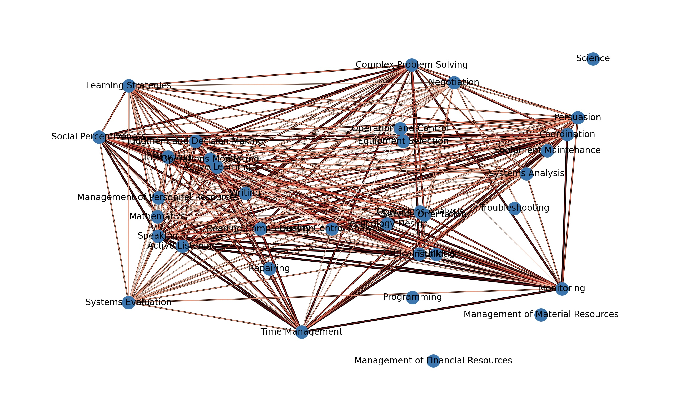

# Skills-Based Career Navigator
# Team Members

Ken Nelson and Dianna Mega

# Project Description

The problem we're tackling is the disconnect between individuals and the evolving job market. This disconnect leads to several issues:
For Students: High schoolers often lack the resources to make informed decisions about college majors or career paths, leading to potential wasted time and money on unsuitable education.
For Career Changers: Individuals seeking new careers struggle to identify roles that align with their existing skills, hindering efficient job searching and career transitions.
For Educational Institutions: Trade schools and universities may find it challenging to keep their curriculum aligned with the skills demanded by emerging industries, potentially leaving graduates ill-prepared for the workforce.
This project aims to bridge this gap by creating a tool that:
Empowers individuals to make data-driven decisions about their education and career paths.
Facilitates efficient career transitions by matching existing skills to in-demand jobs.
Enables educational institutions to adapt their curriculum to meet future workforce needs.
By addressing these issues, we aim to promote better alignment between individual skills and labor market demands, leading to more fulfilling careers and a more efficient workforce.

# Basic Functionality Features

Interactive Skill Matching: Interactive Skill Matching allows users to input their skills and interests, then matches them with relevant occupations and educational paths. This dynamic tool helps users explore career options and identify potential skill gaps they may need to address.
Occupation Exploration: Occupation Exploration provides detailed insights into various occupations, including required skills, projected growth, and potential salary ranges. This feature enables users to research potential career paths and make informed decisions.
Personalized Skills Development Roadmap: Personalized Skills Development Roadmap creates a tailored plan for users to acquire the necessary skills for their target occupation, including recommendations for courses, certifications, and other learning resources. This feature helps users bridge their skill gaps and enhance their employability.

# Nice to Have Functionality Features

Educational Pathway Guidance: Educational Pathway Guidance makes recommendations on potential educational paths, including college majors and vocational programs, based on a user's chosen career interests and skillset. This helps users identify programs that will best prepare them for their desired field.
Regional Workforce Analysis: Regional Workforce Analysis allows users to explore skill demands and occupation trends within specific geographic areas. This feature helps individuals and institutions understand local labor market dynamics and make informed decisions based on regional needs.
Policy Recommendation Generation: Policy Recommendation Generation analyzes skills gaps and future workforce needs to suggest policy recommendations, such as developing targeted education programs or workforce development initiatives.

# Skills Exploration Tools

This is a starter repository for projects in the CAS502 class in the School of Complex Adaptive Systems at Arizona State University. If you choose to use the code in this repository for your project, please clone it into your own account and work with your clone.

## What the code does

This script will read the skills in `data/Skills.xlsx` (which is pretty much a list of types of jobs and what skills each job requires) and create a weighted graph from it. Each skill is identified by an "Element ID" of the form `Number.Letter.Number.letter` (e.g. `2.A.1.a`). The script will create a node for each skill id and if two skills are used in the same job type, the nodes will be connected. The more often two skills are used together for a job type, the greater the weight on the edge between those two nodes. The resulting network looks something like that (darker and thicker edges have more weight):


After creating the network, the script will ask the user for a skill id and then print the first 10 skills most often used with the entered skill and 5 job types in which both skills are used, e.g.

```
Often used skills with "Active Learning (2.A.2.b)":
"Active Listening (2.A.1.b)" e.g. as Judges, Magistrate Judges, and Magistrates (5.0), Marriage and Family Therapists (4.88), Child, Family, and School Social Workers (4.88), Editors (4.88), Historians (4.75)
...
```

## Set up

To set up the project, clone the repository. You need the following packages installed:
- pandas
- openpyxl
- networkx
- matplotlib

## How to run the code

To execute the tool, simply run `python skills.py`. It will run for a few moments and then ask you for a skill code. You can find the codes for each skill in the file `skills-list.csv` (e.g. `2.A.1.a` for "Reading Comprehension"). Once entered, the program will present you with a list of 10 skills are that are most often used in combination with the entered skill and the top five professions in which a skill is important for.

## Repository content

The following files are part of this repository:

- `skills.py`  
The code for this program.
- `skills-list.csv`  
CSV file with a list of skills and their codes.
- `data`  
This folder contains a number of data files. The files have been downloaded from [O*NET Resource Center](https://www.onetcenter.org/database.html), version 29.1 ([license](https://creativecommons.org/licenses/by/4.0/)). The file currently used in the code is `Skills.xlsx`. Additionally, there are two files in this folder:
  - `Occupation Data.xlsx`: Descriptions for each occupation.
  - `TechnologySkills.xlsx`: A list of technological skills for each occupation.

## Notes

This repository is intentially left pretty barebone, so you can use it for all the assignments in CAS502.
>>>>>>> 723d8c5c974f113c03b54868eee60c8a8a1838a5
